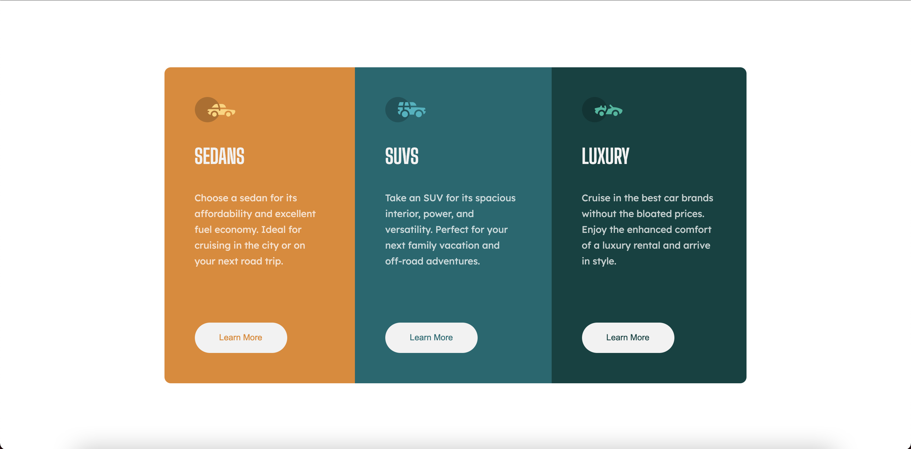

# Frontend Mentor - 3-column preview card component solution

This is a solution to the [3-column preview card component challenge on Frontend Mentor](https://www.frontendmentor.io/challenges/3column-preview-card-component-pH92eAR2-). Frontend Mentor challenges help you improve your coding skills by building realistic projects. 

## Table of contents

- [Overview](#overview)
  - [The challenge](#the-challenge)
  - [Screenshot](#screenshot)
  - [Links](#links)
- [My process](#my-process)
  - [Built with](#built-with)
  - [What I learned](#what-i-learned)
  - [Continued development](#continued-development)
- [Author](#author)

## Overview

### The challenge

Users should be able to:

- View the optimal layout depending on their device's screen size
- See hover states for interactive elements

### Screenshot

### Links

- Solution URL: [Frontend Mentor](https://www.frontendmentor.io/solutions/responsive-3-column-preview-card-component-pbl4ytWYz)
- Live Site URL: [GitHub Pages](https://brendanmadden.github.io/3-column-preview-card-component/)

## My process

### Built with

- Semantic HTML5 markup
- CSS custom properties
- Flexbox

### What I learned

I continued to build on my knowledge of CSS flexbox during this challenge. I also worked on implementing more effective planning and organization to this project, and I was very happy with the results. I was able to complete this project more quickly than the previous, and the results are without a doubt better.

### Continued development

I'd like to continue to learn and increase my knowledge of CSS and flexbox. I'd like to get better at ensuring I'm utilizing best practices when it comes to accessibility and semantic HTML. As I continue with these frontend mentor challenges, and with my frontend development journey, I want to make sure that I'm learning strong fundamentals that I can continue to build on as I continue to learn and grow as a developer.  

## Author

- GitHub - [Brendan Madden](https://github.com/brendanmadden)
- Frontend Mentor - [@brendanmadden](https://www.frontendmentor.io/profile/brendanmadden)
- Twitter - [@BrendanMadden_](https://www.twitter.com/BrendanMadden_)
